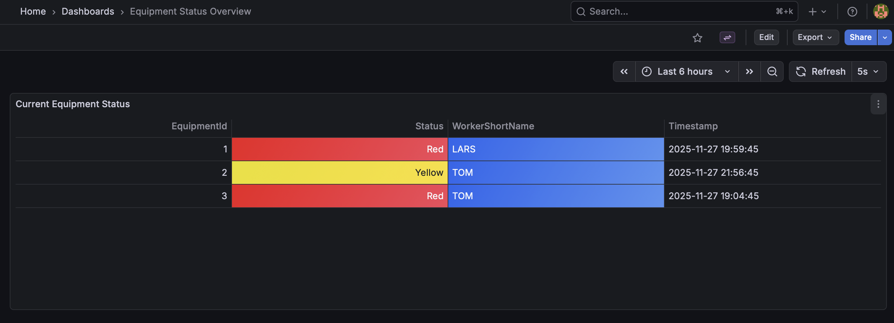
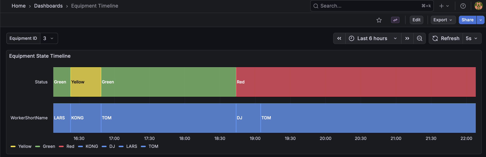

# factory-state-management: State management and Visualisation project

factory-state-management exposes api endpoints to store and retrieve state update events for factory equipment.


_Equipment Overview Dashboard showing real-time status._


_Historical Timeline Dashboard visualizing state changes over time._

**Features**:

- _FactoryAPI_: C# MinimalApi project for storing history of changes to equipment sates. POST StateEvent and GET StateEvents endpoints.
- _Postgres database_ for persisting time-based StateEvents.
- _Grafana Historical Timeline Dashboard_: Allows showing and browsing the historical changes to the equipmeng.
- _Grafana Equipment Overview Dashboard_: Shows the state (red/yellow/red) of all equipment ids that have had a StateEvent posted. Live updates are reflected in the dashboards.

**TODOs:**

- Store DB secrets in environment and pass in `IConfiguration` to replace in appsettings.json `DefaultConnection`.
- Integration tests.
- Add API Dockerfile and Generate SSL dev certs and mount them to Dockerfile.
- Add jwt authentication and authorize endpoints with policies. E.g., `[Authrize(Policy="Worker")]`

## Repository Structure

- [src/FactoryApi](src/FactoryApi): C# MinimalApi project that the defines the StateEvent model and exposes PostState and GetState endpoints.
- [tests/FactoryTests](src/FactoryTests): C# xUnit test project for FactoryApi with 
- [grafana](grafana/): grafana as code datasource, alert, and dashboard provisioning config.

Solution Components:

- _FactoryAPI_: C# MinimalApi project for storing history of changes to equipment sates. POST StateEvent and GET StateEvents endpoints.
- _Prostgres_: Persistence for state events.
- _Grafana_: Visualization of current machine states and of states of the equipment.

### Architcture

### Packages

Application:

- Scalar.AspNetCore
- Microsoft.EntityFrameworkCore
- Npgsql.EntityFrameworkCore.PostgreSQL
- Microsoft.EntityFrameworkCore.Design

Testing:

- Microsoft.AspNetCore.Mvc.Testing
- FluentAssertions
- Microsoft.EntityFrameworkCore.InMemory

## Quickstart

### Prereqs

- .Net10
- Docker Daemon
- Configure HTTPS dev certs (see below)
- Set Postgres secrets (see below)

### HTTPS Certs (Local)

```´bash
dotnet dev-certs https
dotnet dev-certs https --trust 
```

### HTTPS

### Docker Compose

```bash
docker compose up -d
```

### EF Core Migrations

```bash
dotnet tool install --global dotnet-ef
```

```bash
dotnet ef migrations add --project src/FactoryApi/FactoryApi.csproj --startup-project src/FactoryApi/FactoryApi.csproj init
```

```bash
dotnet ef database update --project src/FactoryApi/FactoryApi.csproj --startup-project src/FactoryApi/FactoryApi.csproj
```

```bash

```

*Example connection string:*

```text
"Host=localhost;Port=5432;Database=state_db;Username=sa;Password=password;Trust Server Certificate=true;"
```
